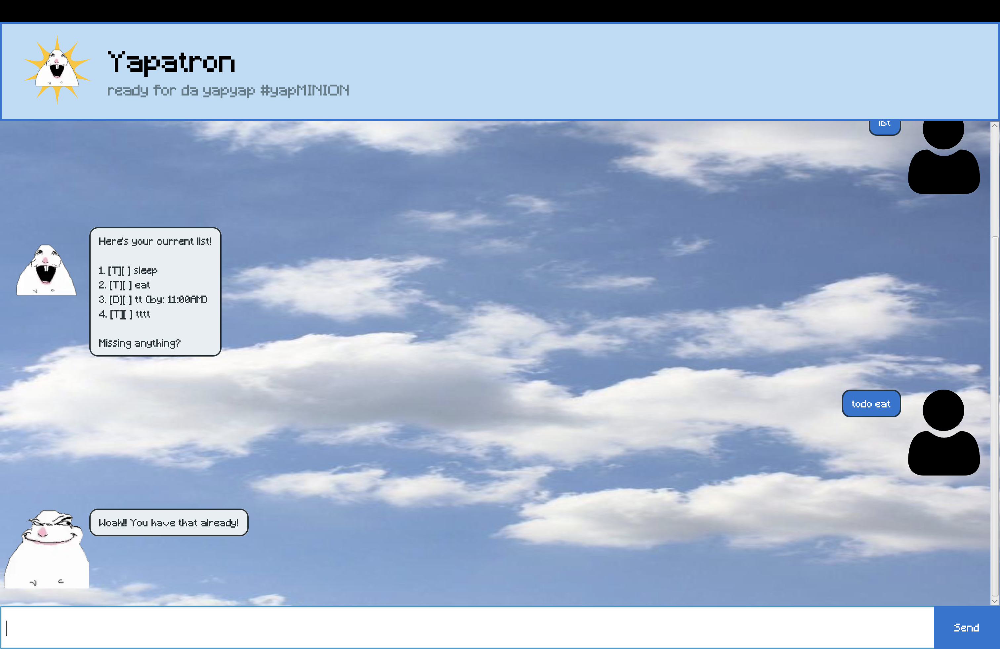

# Yapatron User Guide



Yapatron is chatbot that helps you manage your tasks. Its abilities include allowing you to create, search, mark and delete tasks using commands.

## Getting started

### Requirements
- JDK 25
- An IDE or terminal
- The zip file or jar, which can be found [here](https://github.com/carlyngohing/ip/releases/tag/A-Release)

### To run the application

If you downloaded the zip file of the project:

From the project root, run:
```
./gradlew run
```

With the jar file, run:
```
java -jar "Yapatron.jar"
```

This runs the main JavaFx GUI. Type 'help' for commands.


## Creating tasks

### Todo tasks

Create a simple todo task with
```
todo <description>
```

This adds a todo task to the list of tasks.

Example:
```
todo sleep
```

### Deadline and Event tasks

Create tasks with specific time frames.

For deadline:
```
deadline <description> /by <date and time>
```

This is for tasks with deadlines.

For event:
```
event <description> /from <start> /to <end>
```

This is for tasks with time frames.

When called, the tasks will be added to your task list.

Example:
```
event training /from 1930 /to 2200
```
## Marking tasks

Mark or unmark specific tasks to show their completion status. The task number used below is their index in the last list.

Task numbers start at 1.

To mark:
```
mark <task number>
```

Marked tasks will have a 'X' next to them.

To unmark:
```
unmark <task number>
```

Example:
```
unmark 2
```
## View your task list

To view your task list, type:
```
list
```
Yapatron will return your entire numbered task list.

##Search through your list

To search through your task list, type:
```
find <keyword>
```

Yapatron supports partial searches, so it will still return a result even if you forget the full name of the task.

Example:
```
find sleep
```

## Delete tasks

To delete a task, type:
```
delete <task number>
```

This removes the task at that index from the list, and updates the list accordingly.

## Error messages

When an invalid input is entered, Yapatron will report a message to inform you. Common errors include:

- Missing task descriptions
- Missing task timings for events and deadlines
- Invalid task numbers (according to the list)
- Invalid start and end times

## Leave the bot
To close the application, type:
```
bye
```


